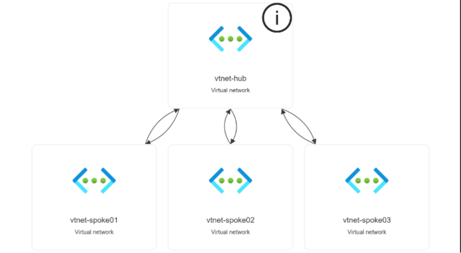
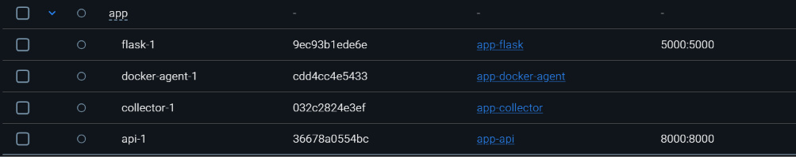

# The Knowledge Hub - Hybrid Infrastructure

Individual infrastructure project growing from an on-premises GNS3 environment into a hybrid Azure architecture.

---

## Overview

This project focuses on designing and implementing a secure, manageable, and scalable infrastructure environment for a fictional library organization called **The Knowledge Hub**.

The goal of this project was to modernize the organization's infrastructure by starting with a traditional on-premises network and gradually building it into a hybrid cloud environment using Microsoft Azure. The project focused on network segmentation, centralized identity management, security controls, monitoring, and automation.

This was an individual school project completed in multiple stages:

---

## Stage 1 - On-Premises Infrastructure

The first stage focused on building the foundation of an enterprise network using GNS3.

Implemented components:

- VLAN segmentation using a managed Exos Network switch
- pfSense firewall for traffic control and network security using firewall rules
- Windows Active Directory for centralized authentication
- DNS and DHCP services
- File server with controlled access using Active Directory groups, OUs, and Group Policy Objects (GPOs)
- Network separation between staff, public users, and server resources

The goal was to create a secure environment where access between network segments was controlled.

### On-Premises Network Topology

---

## Stage 2 - Hybrid Azure Environment

The second stage extended the infrastructure into Microsoft Azure by introducing cloud resources and hybrid connectivity.

Implemented components:

- Azure Hub-Spoke network architecture
- Virtual Networks (VNets) and subnet segmentation
- Network Security Groups (NSGs) to control traffic between subnets
- IPsec Site-to-Site VPN connection between the on-premises environment and Azure
- Azure monitoring for resource health and performance
- Alerting for abnormal CPU, memory, and disk usage

The focus of this stage was improving scalability while maintaining security through segmentation and Azure monitoring.

### Azure Hybrid Architecture

---

## Stage 3 - Secure Containerized Monitoring Platform

The final stage focused on modernizing the monitoring platform by improving deployment flexibility, security, and automation.

Implemented components:

- Containerized monitoring services using Docker
- Python-based monitoring agents and API services
- Flask dashboard for displaying collected metrics
- Microsoft Entra ID authentication
- CI/CD pipeline using GitHub Actions
- Introduction of Zero Trust Architecture principles
- Improved security through service separation and least privilege concepts

This stage provided the most growth because it required deeper research into cloud security, automation, and modern application deployment practices.

### Monitoring Platform Architecture

---

## Technologies Used

### Infrastructure
- GNS3
- pfSense
- Extreme Networks switching
- Windows Server
- Active Directory
- Linux

### Networking
- VLANs
- Routing
- Firewall rules
- DNS
- DHCP
- IPsec VPN
- Azure Virtual Networks (VNets)
- Subnets
- Network Security Groups (NSGs)
- Hub-Spoke Architecture

### Cloud & Security
- Microsoft Azure
- Microsoft Entra ID
- Azure Monitor
- Azure Alerts
- Private Endpoints
- Role-Based Access Control (RBAC)
- Zero Trust principles

### Development / Automation
- Python
- Flask
- Docker
- Docker Compose
- GitHub Actions
- CI/CD
- Linux CLI

---

# Architecture

The environment consists of an on-premises network connected with Azure resources.

Segmentation is implemented using VLANs, VNets, subnets, and security rules to reduce unauthorized access and lateral movement.

The overall architecture evolved from a traditional enterprise network into a hybrid cloud environment.

---

## Identity Management

Active Directory was used for centralized identity management in the on-premises environment.

Organizational Units (OUs), security groups, and Group Policy Objects were used to control access and apply security policies.

---

## Features / Implementation

### Networking

- VLAN segmentation
- Firewall configuration
- Routing between networks
- Network security rules
- Hybrid VPN connectivity

### Cloud

- Azure Virtual Networks
- Hub-Spoke architecture
- Private endpoints
- Secure remote access using Azure Bastion

### Identity

- Active Directory
- Entra ID integration
- Role-based access control

### Monitoring

- Logging
- Metrics collection
- Resource monitoring
- Alerting
- Containerized monitoring services

---

## Security Considerations

Security was considered throughout the entire project.

Implemented security measures:

- Network segmentation to reduce lateral movement
- Firewall rules controlling communication between VLANs
- NSGs using a default-deny approach
- Role-based access control
- Private endpoints for backend resources
- Identity-based authentication using Active Directory and Entra ID
- Secure communication using HTTPS

---

## Testing & Validation

The environment was validated through multiple tests:

- Tested VLAN isolation
- Verified firewall rules using allowed and blocked traffic tests
- Tested Active Directory authentication
- Verified GPO restrictions
- Validated Azure NSG behaviour
- Tested hybrid connectivity
- Verified monitoring data collection
- Tested container deployment

---

## CI/CD Automation

GitHub Actions was used to automate validation and deployment processes.

The pipeline verifies changes before deployment, reducing configuration mistakes and improving consistency.

---

## Challenges & Lessons Learned

Key lessons learned:

- This project was my introduction to infrastructure and cloud technologies. Before this project I had limited experience with networking concepts, but building this environment significantly improved my understanding of enterprise infrastructure.

- Documentation is important for maintaining knowledge and improving scalability.
- Security needs to be considered during architecture design rather than added afterwards.
- Proper network planning prevents redesign later.
- Hybrid environments require careful consideration of identity, networking, and security dependencies.
- Automation improves consistency and reduces human error during configuration.

---

## Future Improvements

Possible improvements:

- Fully implement Infrastructure as Code using Terraform or Bicep
- Add Azure Firewall for advanced network protection
- Integrate Microsoft Sentinel for security monitoring
- Improve automated testing
- Expand Zero Trust implementation
- Improve IPv6 support

---

## Project Status

Completed

---

## Author

Quinn Daamen

GitHub: your-profile-link
