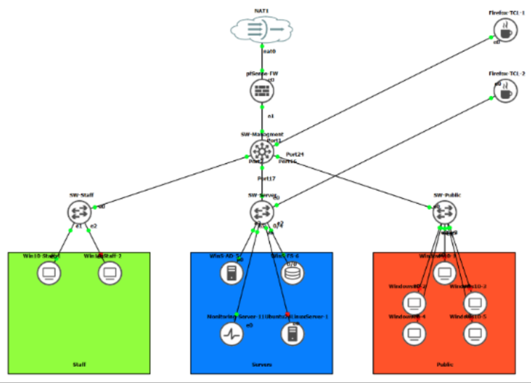
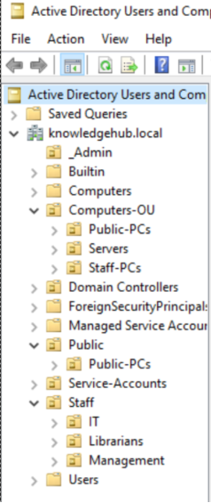

# The Knowledge Hub - Hybrid Infrastructure

An individual infrastructure project where I built a fictional library's IT environment from the ground up, starting with an on-premises network in GNS3 and eventually extending it into a hybrid Azure environment.

---

## Overview

I built this project as part of my first semester of Networking & Cloud at Fontys.

This project focuses on designing and implementing a secure, manageable, and scalable infrastructure environment for a fictional library organization called **The Knowledge Hub**.

The goal of this project was to modernize the organization's infrastructure by starting with a traditional on-premises network and gradually building it into a hybrid cloud environment using Microsoft Azure. The project focused on network segmentation, centralized identity management, security controls, monitoring, and automation.

This was an individual school project completed in multiple stages:

---

## Stage 1 - On-Premises Infrastructure

I started by building the basic enterprise network in GNS3.

The goal was to create a network where different types of users and resources were separated instead of putting everything into one large network.

Implemented components:

- VLAN segmentation using a managed Exos Network switch
- pfSense firewall for traffic control and network security using firewall rules
- Windows Active Directory for centralized authentication
- DNS and DHCP services
- File server with controlled access using Active Directory groups, OUs, and Group Policy Objects (GPOs)
- Network separation between staff, public users, and server resources

The main thing I learned in this stage was how much planning is required before adding more services. VLANs, IP addressing, DNS, DHCP, Active Directory, and firewall rules all depend on each other.

### On-Premises Network Topology

---

## Stage 2 - Hybrid Azure Environment

Once the on-premises environment was working the next goal was to move a part of the network to the cloud

I built a hybrid environment in Azure and connected it back to the GNS3 network using an IPsec site-to-site VPN.

Implemented components:

- Azure Hub-Spoke network architecture
- Virtual Networks (VNets) and subnet segmentation
- Network Security Groups (NSGs) to control traffic between subnets
- IPsec Site-to-Site VPN connection between the on-premises environment and Azure
- Azure monitoring for resource health and performance
- Alerting for abnormal CPU, memory, and disk usage

This stage made me understand that moving infrastructure to the cloud doesn't remove the networking and security problems. You still have to think about segmentation, routing, access control, identity, and how different resources communicate.

### Azure Hybrid Architecture

---

## Stage 3 - Secure Containerized Monitoring Platform

The final stage was where the project became more development-focused.

Instead of only managing infrastructure manually, I built a small monitoring platform using Python and Docker.

Implemented components:

- Containerized monitoring services using Docker
- Python-based monitoring agents and API services
- Flask dashboard for displaying collected metrics
- Microsoft Entra ID authentication
- CI/CD pipeline using GitHub Actions
- Introduction of Zero Trust Architecture principles
- Improved security through service separation and least privilege concepts

This was probably the most challenging stage because I had to combine things from different areas rather than working with only networking or only cloud infrastructure.

I had to think about how the containers communicated, how the application was authenticated, how the services were deployed, and what each service actually needed access to.

### Monitoring Platform Architecture

---

## Technologies Used

### Infrastructure
- GNS3
- pfSense
- Extreme Networks switching
- Windows Server
- Active Directory
- Linux

### Networking
- VLANs
- Routing
- Firewall rules
- DNS
- DHCP
- IPsec VPN
- Azure Virtual Networks (VNets)
- Subnets
- Network Security Groups (NSGs)
- Hub-Spoke Architecture

### Cloud & Security
- Microsoft Azure
- Microsoft Entra ID
- Azure Monitor
- Azure Alerts
- Private Endpoints
- Role-Based Access Control (RBAC)
- Zero Trust principles

### Development / Automation
- Python
- Flask
- Docker
- Docker Compose
- GitHub Actions
- CI/CD
- Linux CLI

---

# Architecture

The final environment combines the original on-premises network with resources running in Azure.

The on-premises side uses VLANs and firewall rules to separate different parts of the network. Azure uses VNets, subnets, NSGs, and private endpoints for segmentation too.

The two environments communicate through the site-to-site VPN.

The architecture therefore evolved from:

On-premises network → segmented enterprise network → hybrid Azure network → containerized monitoring platform

This was the main progression of the project.

---

## Identity Management

Active Directory was used for centralized identity management in the on-premises environment.

Organizational Units (OUs), security groups, and Group Policy Objects were used to control access and apply security policies.

---

## Features / Implementation

### Networking

- VLAN segmentation
- Firewall configuration
- Routing between networks
- Network security rules
- Hybrid VPN connectivity

### Cloud

- Azure Virtual Networks
- Hub-Spoke architecture
- Private endpoints
- Secure remote access using Azure Bastion

### Identity

- Active Directory
- Entra ID integration
- Role-based access control

### Monitoring

- Logging
- Metrics collection
- Resource monitoring
- Alerting
- Containerized monitoring services

---

## Security Considerations

Security was considered throughout the entire project.

Implemented security measures:

- Network segmentation to reduce lateral movement
- Firewall rules controlling communication between VLANs
- NSGs using a default-deny approach
- Role-based access control
- Private endpoints for backend resources
- Identity-based authentication using Active Directory and Entra ID
- Secure communication using HTTPS

---

## Testing & Validation

The environment was validated through multiple tests:

- Tested VLAN isolation
- Verified firewall rules using allowed and blocked traffic tests
- Tested Active Directory authentication
- Verified GPO restrictions
- Validated Azure NSG behaviour
- Tested hybrid connectivity
- Verified monitoring data collection
- Tested container deployment

---

## CI/CD Automation

GitHub Actions was used to automate validation and deployment processes.

The pipeline verifies changes before deployment, reducing configuration mistakes and improving consistency.

---

## Challenges & Lessons Learned

Key lessons learned:

- This project was my introduction to infrastructure and cloud technologies. Before this project I had limited experience with networking concepts, but building this environment significantly improved my understanding of enterprise infrastructure.

- Documentation is important for maintaining knowledge and improving scalability.
- Security needs to be considered during architecture design rather than added afterwards.
- Proper network planning prevents redesign later.
- Hybrid environments require careful consideration of identity, networking, and security dependencies.
- Automation improves consistency and reduces human error during configuration.

---

## Future Improvements

Possible improvements:

- Fully implement Infrastructure as Code using Terraform or Bicep
- Add Azure Firewall for advanced network protection
- Integrate Microsoft Sentinel for security monitoring
- Improve automated testing
- Expand Zero Trust implementation
- Improve IPv6 support

---

## Project Status

Completed

---

## Author

Quinn Daamen

GitHub: your-profile-link
